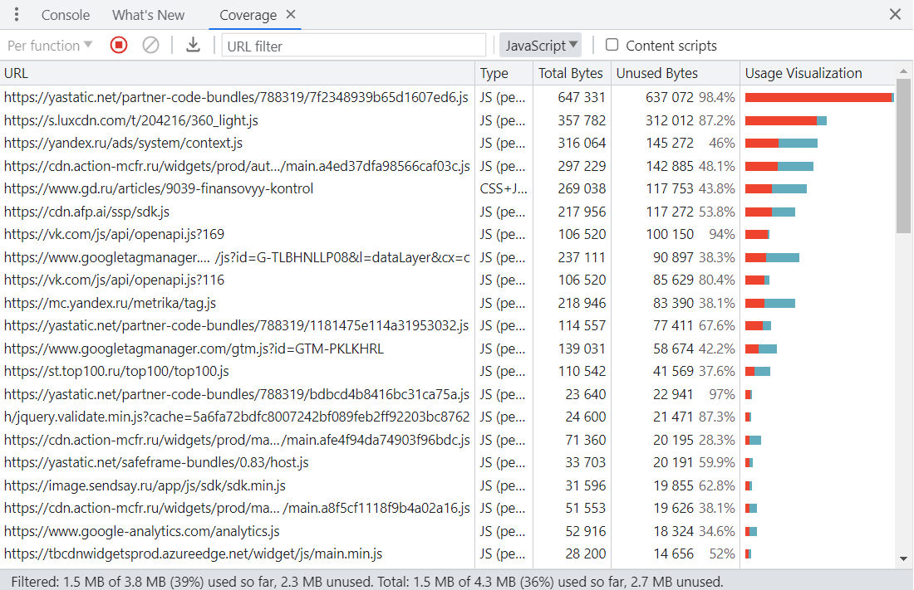

# Использование Chrome DevTools - анализ открытия сайта

## 1. Вкладка Network

Профиль загрузки находится в папке assets.

#### Дублирование ресурсов:

#### Медленно загружающиеся ресурсы:

## 2. Вкладка Performance

Профиль загрузки находится в папке assets.

Время от начала навигации до событий

  -  First Paint (FP): 1512.2 ms
  -  First Contentful Paint (FCP): 1512.2 ms
  -  Largest Contentful Paint (LCP): 8178.7 ms
  -  DOM Content Loaded (DCL): 6231.0 ms
  -  Load: 13005.7 ms

Событие LCP происходит на элементе `img.contentImage__image`.

## 3. Вкладка Coverage

Объём неиспользованного CSS: 548 kB

Объём неиспользованного JS: 2.3 MB (2355kB)

